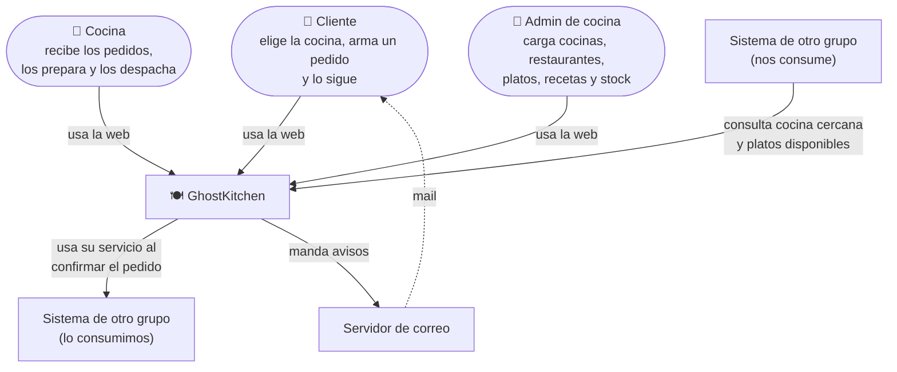
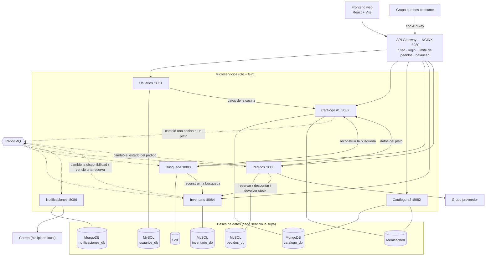
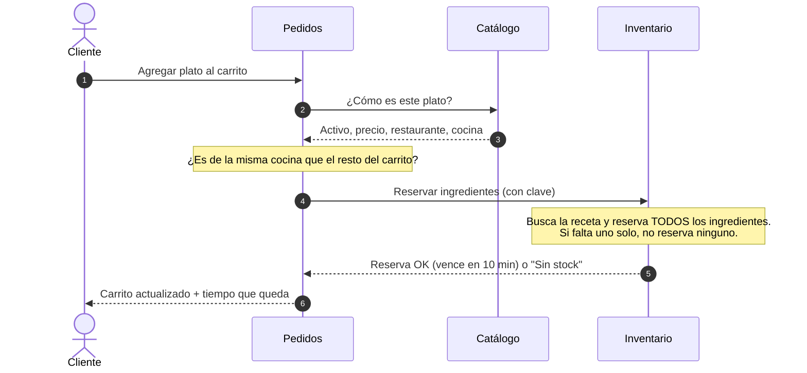
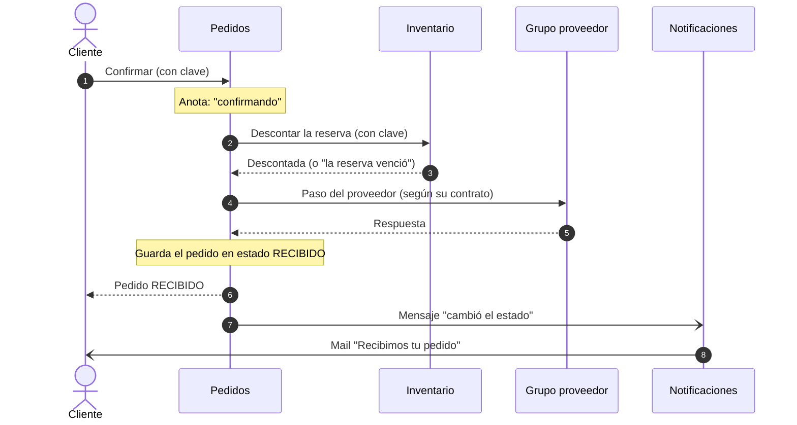
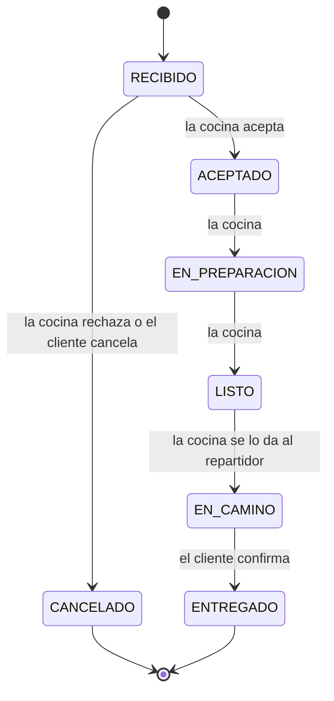
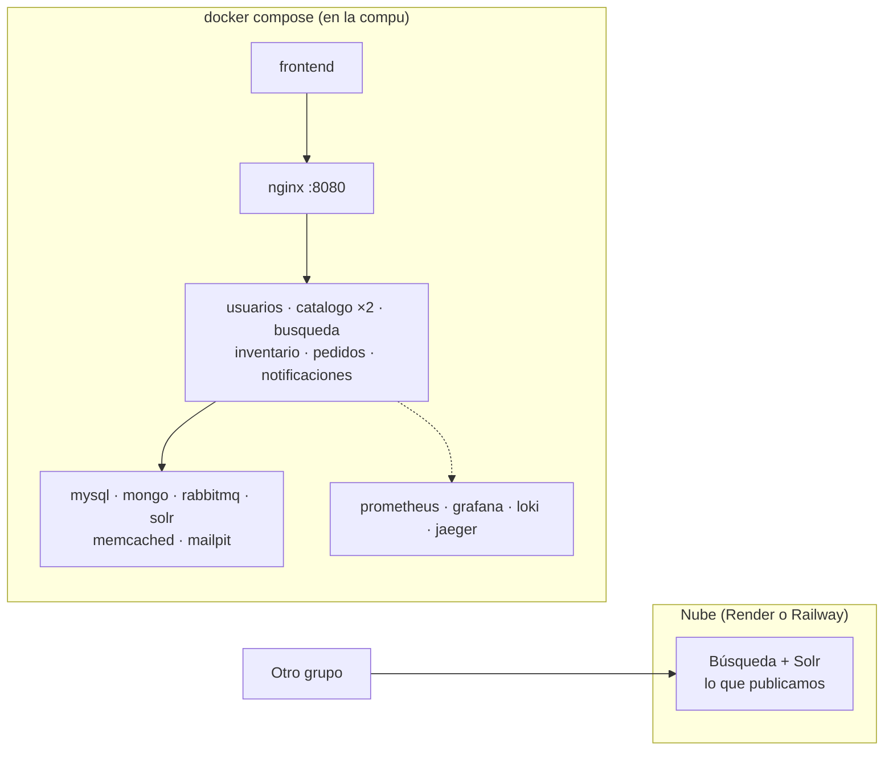

# Arquitectura de GhostKitchen

> **Versión:** Entrega 1 (9/10/2026). Es un diseño preliminar: todavía no hay código de los servicios. Lo único que ya funciona es el **mock del contrato** que publicamos (`docker compose up`).

En este documento explicamos cómo armamos el sistema: qué servicios tiene, qué hace cada uno, qué datos guarda, cómo se comunican, qué pasa cuando algo falla y cómo se despliegan. Por qué tomamos cada decisión está en los [ADR](adr/README.md), y qué tiene que hacer el sistema está en el [SPEC](../SPEC.md).

## Índice

1. [Objetivo](#1-objetivo)
2. [Diagrama de contexto](#2-diagrama-de-contexto)
3. [Diagrama de contenedores](#3-diagrama-de-contenedores)
4. [Los microservicios](#4-los-microservicios)
5. [Cómo se comunican](#5-cómo-se-comunican)
6. [Cómo funciona paso a paso](#6-cómo-funciona-paso-a-paso)
7. [Roles y permisos](#7-roles-y-permisos)
8. [Rutas del gateway](#8-rutas-del-gateway)
9. [Integración con otros grupos](#9-integración-con-otros-grupos)
10. [Qué pasa si algo falla](#10-qué-pasa-si-algo-falla)
11. [Despliegue](#11-despliegue)
12. [Lo que viene en las próximas entregas](#12-lo-que-viene-en-las-próximas-entregas)
13. [Estado de las decisiones](#13-estado-de-las-decisiones)
14. [Limitaciones conocidas](#14-limitaciones-conocidas)

---

## 1. Objetivo

GhostKitchen es una plataforma de pedidos para **4 cocinas fantasma** de Córdoba (Nueva Córdoba, Cerro, Villa Allende y Barrio Jardín). Desde cada cocina venden hasta 4 restaurantes, y todos usan **los mismos ingredientes**.

El cliente elige la cocina desde la que quiere pedir, arma **un solo pedido** con platos de distintos restaurantes de esa cocina, y la cocina lo prepara y lo manda en un solo envío.

Lo más importante del sistema es esto:

> **Nunca vender un plato si no hay ingredientes para hacerlo, aunque muchos clientes pidan al mismo tiempo.**

Ordenamos lo que más nos importa así:

| Prioridad | Qué nos importa | Ejemplo | Cómo lo medimos |
| --- | --- | --- | --- |
| 1 | Que el stock sea correcto | 200 clientes quieren el último plato a la vez | 0 platos vendidos de más |
| 2 | Que se pueda seguir pidiendo | Se cae el mail o la búsqueda | Los pedidos se siguen confirmando |
| 3 | Que responda rápido | Viernes a las 21 h, muchos pedidos | Agregar al carrito tarda menos de 500 ms |
| 4 | Que se pueda escalar | Se duplica la gente mirando el catálogo | Agregamos instancias sin tocar código |
| 5 | Seguridad | Una cocina quiere ver pedidos de otra | No puede |
| 6 | Poder encontrar errores | Falla un pedido | Encontramos la causa en menos de 10 min |

**La decisión más importante que tomamos:** el stock tiene que estar siempre bien, aunque eso lo haga un poco más lento. La búsqueda, en cambio, puede tener unos segundos de atraso (máximo 5 s) a cambio de responder rápido.

## 2. Diagrama de contexto

Muestra quién usa el sistema y con qué otros sistemas se conecta.



| Quién | Qué hace con GhostKitchen |
| --- | --- |
| Cliente | Elige la cocina, busca platos, arma el carrito, confirma y sigue su pedido. Recibe mails. |
| Cocina | Es la cuenta del personal de la cocina. Ve los pedidos de su cocina, los acepta o rechaza y los va avanzando. |
| Admin de cocina | Carga las cocinas de su localidad, los restaurantes, los platos con su receta y los ingredientes. |
| Grupo que nos consume | Usa la capacidad que publicamos ([contrato](contracts/README.md)). |
| Grupo que consumimos | Lo usa el servicio de Pedidos. **Todavía no lo asignó la cátedra.** |
| Servidor de correo | Manda los mails. Para probar en local usamos Mailpit, que los guarda en vez de mandarlos. |

## 3. Diagrama de contenedores

Muestra todas las piezas del sistema. Las flechas llenas son **llamadas directas (HTTP)** y las punteadas son **mensajes por RabbitMQ**.



Además hay herramientas para ver qué pasa en el sistema (Prometheus, Grafana, Loki y Jaeger). No las dibujamos para que el diagrama se entienda. Ver la [sección 12](#12-lo-que-viene-en-las-próximas-entregas).

## 4. Los microservicios

Son **6 microservicios y un API Gateway** (el enunciado pide al menos 3).

**Cómo los separamos:** hicimos un servicio por cada parte del negocio, y cada uno tiene su propia base de datos (Clase 2). Nadie lee la base de otro servicio. Además, todo lo que tiene que pasar "de una sola vez" lo pusimos en el mismo servicio: por eso el stock, las recetas y las reservas están juntos en Inventario. Así, reservar todos los ingredientes de un plato es una sola operación en una sola base. El detalle está en el [ADR-001](adr/ADR-001-limites-de-los-servicios.md).

| Servicio | Qué hace | Qué datos guarda | Base | Cómo está organizado por dentro | Puerto |
| --- | --- | --- | --- | --- | --- |
| **Gateway** (NGINX) | Es la única puerta de entrada: manda cada pedido al servicio que corresponde, verifica que el usuario esté logueado, limita la cantidad de pedidos y reparte la carga entre las 2 copias de Catálogo | — | — | — | 8080 |
| **Usuarios** | Registro, login y roles. Recuerda qué cocina eligió el cliente | Usuarios (contraseña encriptada, dirección, rol, cocina elegida) | MySQL | Capas | 8081 |
| **Catálogo** | Qué se vende y a qué precio: cocinas, restaurantes y platos | Cocinas (con dirección, ubicación, tiempo estimado de entrega y costo de envío) con sus restaurantes, y platos (con su foto) | MongoDB + caché en Memcached | Capas, con la caché "envolviendo" al repositorio | 8082 (2 copias) |
| **Búsqueda** | Buscar platos con filtros, orden y páginas. Sugerir la cocina más cercana. Atiende la capacidad que publicamos | Una **copia** de los datos, armada para buscar rápido | Solr | Capas, con dos entradas: HTTP y un lector de mensajes | 8083 |
| **Inventario** ⭐ | Con qué se hace cada plato y si alcanza: ingredientes, stock, recetas, reservas de 10 minutos, descuentos, devoluciones, reposiciones y mermas | Ingredientes, stock, recetas y reservas (con los ingredientes y cantidades que apartó cada una) | MySQL | Hexagonal liviano | 8084 |
| **Pedidos** ⭐ | Todo el pedido: el carrito, la confirmación, los estados y su historial. Le pide a Inventario que descuente o devuelva stock. Es el que habla con el grupo proveedor | Carritos, pedidos, historial de estados y el avance de cada confirmación | MySQL | Hexagonal + DDD (el pedido controla sus propias reglas) | 8085 |
| **Notificaciones** | Manda un mail cada vez que cambia el estado de un pedido | Qué mails mandó y cuáles faltan | MongoDB | Capas, pero la entrada es RabbitMQ en vez de HTTP | 8086 |

⭐ = los dos servicios donde no se puede equivocar nada.

**Por qué distintos estilos por dentro:** los servicios simples (Usuarios, Catálogo, Búsqueda, Notificaciones) usan **capas** (handler → servicio → repositorio), que es lo que ya conocemos. Los dos importantes usan **arquitectura hexagonal** (Clase 8): las reglas del negocio quedan en el centro y no dependen de la base de datos ni del framework, así se pueden testear solas.
- **Pedidos** usa además **DDD**, porque tiene la máquina de estados más rica y depende de Inventario, Catálogo y un proveedor que todavía no conocemos. Si el proveedor cambia, solo cambia el adaptador.
- **Inventario** es hexagonal **liviano**: tres entradas distintas (HTTP, mensajes y el proceso que vence reservas) usan las mismas reglas. Que no se venda de más lo garantiza MySQL (sección 6.4), y eso se prueba con tests contra una base real.

Esto se termina de justificar en el ADR-002, en la Entrega 2.

### 4.1 Por qué las recetas están en Inventario y no en Catálogo

Catálogo responde **"qué se vende y cuánto sale"**. Inventario responde **"con qué se hace y si alcanza"**. Para reservar un plato hay que saber su receta y el stock al mismo tiempo. Si la receta estuviera en Catálogo, Inventario tendría que tener una copia, y esa copia podría estar desactualizada justo en el momento más importante.

### 4.2 Por qué el pedido es uno solo

El que cocina todo es la **cocina**: los restaurantes son solo marcas, no tienen gente propia. Por eso un pedido con una pizza del Restaurante A y una hamburguesa del Restaurante B es **un solo pedido con un solo estado**. Cuando se muestra, los platos aparecen agrupados por restaurante, solo para armar una bolsa por marca:

```
Pedido #1042 · RECIBIDO · 12:41
  Pizzería Napoli
    2 × Pizza muzzarella
    1 × Fainá
  Burger Lab
    1 × Hamburguesa doble
```

### 4.3 Cómo se pasan los datos entre servicios

Entre servicios solo nos pasamos **IDs** (`cocina_id`, `plato_id`, `pedido_id`). No hay relaciones entre bases distintas (Clase 2).

| Dato | De quién es | Cómo lo consigue otro servicio |
| --- | --- | --- |
| Precio, nombre y restaurante de un plato | Catálogo | Pedidos lo pide al agregar al carrito y **se guarda una copia** en el pedido. Así, si después cambia el precio, el pedido queda con el precio que pagó el cliente |
| Localidad de una cocina | Catálogo | Inventario la recibe por mensajes (para saber qué admin la puede tocar). Usuarios la pide cuando se crea una cuenta Cocina |
| De qué cocina es un plato | Catálogo | Inventario lo recibe por mensajes (para controlar que la receta use ingredientes de esa cocina) |
| Stock y disponibilidad | Inventario | Búsqueda recibe un aviso cuando un plato deja de estar disponible o vuelve a estarlo. Pero **la reserva siempre se controla en Inventario** |
| Mail del cliente | Usuarios | Viene en el token del login. Pedidos lo guarda en el pedido y lo manda en el mensaje, así Notificaciones no tiene que preguntarle a Usuarios |
| Estado del pedido | Pedidos | Notificaciones lo recibe por mensaje |

### 4.4 Una base por servicio, pero en pocas instancias

Para no levantar 5 bases en cada compu, en local usamos **un solo MySQL** con una base por servicio (`usuarios_db`, `inventario_db`, `pedidos_db`) y **un solo MongoDB** con una base por servicio (`catalogo_db`, `notificaciones_db`). Cada servicio tiene un usuario que solo puede entrar a su base. La Clase 2 permite esta opción: lo importante es que **ningún servicio entre a la base de otro**. Más detalle en el [ADR-003](adr/ADR-003-persistencia.md).

### 4.5 Qué viene de la materia y qué agregamos nosotros

Usamos lo visto en clase para todo lo que la materia cubre. Donde el enunciado pide algo para lo que no vimos herramientas, elegimos una y la justificamos en su ADR:

| Vista en la materia | La agregamos nosotros | Para qué | ADR |
| --- | --- | --- | --- |
| Go + Gin, MySQL, MongoDB, Memcached, Solr, RabbitMQ, NGINX, Docker Compose | — | Servicios, datos, caché, búsqueda, mensajería, gateway y ejecución local | 001, 003, 005 |
| — | React + Vite | Frontend (el enunciado deja elegir) | — |
| — | Prism | Mock del contrato a partir del OpenAPI | 008 |
| — | Mailpit | Servidor de correo de prueba en local | 005 |
| — | Prometheus, Grafana, Loki, Jaeger (OpenTelemetry) | Métricas, tablero, logs y trazas (el enunciado los pide; las clases no presentan herramientas) | 011 |
| — | k6 | Tests de carga | 013 |

### 4.6 Qué hay en el repositorio

```
GhostKitchen/
├── services/                 Un README por microservicio
├── gateway/                  Qué hace el gateway NGINX
├── docs/
│   ├── ARCHITECTURE.md       Este documento
│   ├── adr/                  Las decisiones que tomamos
│   └── contracts/            El contrato de lo que publicamos
├── SPEC.md                   Qué tiene que hacer el sistema
└── docker-compose.yml        Para levantar todo con un comando
```

En esta entrega cada servicio tiene solo su README. Desde la Entrega 2 se suma el código de cada servicio, el frontend, `pkg/` (código técnico compartido) y la configuración de las herramientas de monitoreo.

## 5. Cómo se comunican

El detalle está en el [ADR-005](adr/ADR-005-comunicacion-entre-servicios.md). La regla que usamos es:

- **Llamada directa (síncrona, HTTP)** cuando necesitamos la respuesta en ese momento para contestarle al usuario. Ejemplo: ¿hay stock?, ¿cuánto sale el plato?
- **Mensaje (asíncrono, RabbitMQ)** cuando la tarea puede hacerse un rato después. Ejemplo: mandar el mail, actualizar la búsqueda, avisar que venció una reserva.

### 5.1 Llamadas directas

**Ningún pedido del usuario espera más de 3 segundos.** Para que eso se cumpla, cada operación tiene un **tiempo total de 3 s** que se pasa de una llamada a la siguiente (`context.WithTimeout`, Clase 7): si una llamada se demoró, la siguiente tiene menos tiempo, no un reloj nuevo. Los tiempos de abajo son el máximo de **cada intento**, siempre dentro de ese total.

| Quién llama → a quién | Para qué | Tiempo máximo por intento | ¿Reintenta? |
| --- | --- | --- | --- |
| Gateway → Usuarios | Verificar que el usuario esté logueado | 300 ms | No |
| Usuarios → Catálogo | Ver la cocina cuando el admin crea una cuenta Cocina | 800 ms | Sí, 1 vez |
| Pedidos → Catálogo | Ver el plato (si está activo, precio, restaurante, cocina) | 500 ms | Sí, 1 vez |
| Pedidos → Inventario | Reservar, cambiar o liberar ingredientes | 800 ms | 1 vez, con la misma clave |
| Pedidos → Inventario | Descontar o devolver stock | 800 ms | 1 vez, con la misma clave (después sigue el proceso de recuperación, sección 6.5) |
| Pedidos → grupo proveedor | Depende de lo que nos asignen | lo que quede del total | Según su contrato |
| Búsqueda → Catálogo e Inventario | Reconstruir la búsqueda desde cero (proceso de fondo, no lo espera ningún usuario) | 5 s | Sí, 3 veces |

Peor caso de "agregar al carrito": 300 ms (gateway) + 2 × 500 ms (Catálogo) + 2 × 800 ms (Inventario) = **2,9 s**.

- **"Con la misma clave"** significa que si reintentamos, mandamos el mismo identificador (`Idempotency-Key`). Así Inventario se da cuenta de que es la misma operación y **no descuenta dos veces**.
- Si un servicio falla muchas veces seguidas, dejamos de llamarlo un rato (**circuit breaker**) para no empeorar las cosas (Clase 7).
- Solo reintenta el servicio que hace la llamada: el frontend y el gateway **no reintentan** operaciones que cambian datos, para no multiplicar los intentos (Clase 7).
- No hay llamadas en círculo: Catálogo e Inventario nunca llaman a Pedidos.

### 5.2 Mensajes por RabbitMQ

Cada servicio que escucha tiene **su propia cola**. Si un mensaje falla muchas veces, va a una cola aparte de mensajes con error (**DLQ**) para revisarlo después (Clase 4).

| Mensaje | Quién lo manda | Quién lo escucha | Para qué |
| --- | --- | --- | --- |
| `cocina.*` (se creó, cambió o se desactivó una cocina) | Catálogo | Búsqueda, Inventario | Actualizar la búsqueda; saber la localidad de cada cocina |
| `plato.*` (se creó, cambió o se desactivó un plato) | Catálogo | Búsqueda, Inventario | Actualizar la búsqueda; saber de qué cocina es cada plato |
| `disponibilidad.cambiada` | Inventario | Búsqueda | Mostrar si un plato se puede pedir |
| `reserva.vencida` | Inventario | Pedidos | Marcar el carrito como vencido |
| `pedido.estado_cambiado` | Pedidos | Notificaciones | Mandar el mail |

Cada mensaje lleva un identificador único, su tipo, una versión, la fecha y el identificador de la operación que lo originó (para seguirlo en los logs).

Para no perder mensajes usamos **outbox** (Clases 2 y 4): el servicio guarda el cambio y el mensaje en la misma operación de la base, y después otro proceso lo manda a RabbitMQ. Si RabbitMQ estaba caído, el mensaje queda guardado y se manda cuando vuelve.
- En **Inventario y Pedidos** (MySQL), el mensaje va a una tabla `outbox` en la misma transacción.
- En **Catálogo** (MongoDB), el cambio y el mensaje se guardan en una transacción de MongoDB, que necesita levantar MongoDB como *replica set* (aunque sea de un solo nodo). Sin eso, Mongo y RabbitMQ no tendrían forma de quedar sincronizados.

Como un mensaje puede llegar **dos veces**, cada servicio anota qué mensajes ya procesó para no repetir el efecto, y le confirma a RabbitMQ recién **después** de guardar el resultado.

## 6. Cómo funciona paso a paso

### 6.1 Entrada al sistema

Todo lo que hace el frontend pasa por el **gateway NGINX**, que lo manda al servicio que corresponde.

- Si la acción necesita estar logueado, el gateway le pregunta a Usuarios si el token es válido (`auth_request`).
- El gateway solo verifica **quién es** el usuario. **Qué puede hacer** lo controla cada servicio. Por ejemplo, Pedidos controla que una cocina solo pueda tocar sus propios pedidos.
- Las solicitudes a Catálogo se reparten entre sus 2 copias.

### 6.2 Elegir la cocina

El cliente **no pone su localidad al registrarse**, porque puede pedir a distintas cocinas en distintos momentos. Cuando entra (o cuando quiere cambiar):

1. Escribe su zona (por ejemplo "Argüello").
2. Búsqueda le sugiere la cocina más cercana a esa zona.
3. El cliente elige esa u otra de las 4.
4. Usuarios guarda la cocina elegida para la próxima vez.

### 6.3 Buscar platos

Búsqueda tiene una **copia** de los platos en Solr, armada para buscar rápido por texto, filtrar (restaurante, categoría, etiqueta, precio, disponibilidad), ordenar y paginar (Clase 5).

Esa copia se mantiene al día con los mensajes de Catálogo y de Inventario, con un **atraso máximo de 5 segundos**. Por eso, que un plato figure "disponible" en la búsqueda es solo orientativo: **cuando el cliente lo agrega al carrito, Inventario vuelve a controlar el stock real.** Un plato sin receta no aparece como disponible.

Cada dato en la copia guarda la **versión** que tenía en Catálogo o Inventario. Si llega un mensaje viejo o repetido, o si se está reconstruyendo la búsqueda al mismo tiempo, solo se guarda lo que tenga una versión más nueva. Así un dato atrasado nunca pisa uno actual (Clase 5).

### 6.4 Agregar al carrito (reserva de ingredientes)

Pedidos guarda el **carrito**. Inventario guarda la **reserva** de los ingredientes.



La reserva de todos los ingredientes se hace en **una sola operación de la base**. Para cada ingrediente, MySQL ejecuta:

```sql
UPDATE ingrediente SET reservado = reservado + ?
 WHERE id = ? AND total - reservado >= ?;
```

La base solo suma lo reservado **si alcanza**; si para algún ingrediente no se actualiza ninguna fila, se deshace todo. Mientras una operación toca una fila, la otra espera, y cuando le toca vuelve a mirar el valor actualizado. Así, si dos personas quieren el último plato a la vez, solo una lo consigue. Como el control está en la base y no en la memoria del servicio, funciona aunque haya varias copias de Inventario.

Además:
- **La reserva guarda los ingredientes y cantidades que apartó.** Si el admin cambia una receta mientras hay carritos abiertos, liberar o descontar usa lo que se apartó, no la receta nueva. Si no, el stock quedaría mal.
- **Un solo carrito activo por cliente:** lo garantiza un índice único en la base, aunque lleguen dos pedidos a la vez.
- **Un plato sin receta o desactivado no se puede reservar.**
- El frontend manda **la cantidad final** de cada plato (por ejemplo, "quiero 2") y no "sumá uno". Así, si la misma solicitud llega dos veces, no se reserva de más.

Si el cliente cambia cantidades o saca un plato, Pedidos le pide a Inventario que reserve lo que falta o libere lo que sobra.

### 6.5 Confirmar el pedido

Confirmar toca dos servicios (Pedidos e Inventario), así que no se puede hacer en una sola operación de base. Por eso Pedidos **coordina los pasos uno por uno y anota en qué paso va** (a esto se le llama **saga**, Clase 2).



- El pedido queda confirmado solo si **todos los pasos obligatorios** salen bien.
- **En qué paso va la confirmación se guarda aparte del estado del pedido.** El pedido recién existe, en RECIBIDO, cuando terminó todo.
- **Si una llamada no contesta a tiempo**, no sabemos si se hizo o no. Entonces Pedidos primero **pregunta** si se hizo, antes de repetir o deshacer. Si repitiera a ciegas, podría descontar dos veces.
- **Si un paso falla después de descontar**, Pedidos le pide a Inventario que devuelva el stock. Devolver no es "deshacer": es una operación nueva del negocio (Clase 2).
- **Si Pedidos se cae a mitad de camino**, un proceso de Pedidos revisa cada tanto las confirmaciones que quedaron a medias y las termina o las compensa, a partir del paso guardado.
- **Si el cliente toca "confirmar" dos veces**, como manda la misma clave, se devuelve el mismo pedido: no se crean dos.

### 6.6 Cuando vence el carrito

Inventario revisa cada 15 segundos las reservas vencidas (más de 10 minutos) y libera los ingredientes. Esto pasa **dentro de Inventario**, así que funciona aunque Pedidos esté caído. Después manda el mensaje `reserva.vencida` y Pedidos marca el carrito como vencido.

Igual, cuando el cliente confirma, Inventario vuelve a controlar que la reserva no haya vencido. **Descontar y vencer bloquean la misma reserva en la base**, así que si pasan al mismo tiempo, solo uno de los dos tiene efecto.

### 6.7 La cocina prepara el pedido

La cocina va avanzando el pedido y Pedidos controla que cada paso sea válido:



- **No hay estado "rechazado":** si la cocina rechaza, el pedido queda CANCELADO, igual que si cancela el cliente. Solo se puede desde RECIBIDO.
- **Al cancelar**, Pedidos le pide a Inventario que devuelva los ingredientes. Si Inventario no contesta, queda anotado y se reintenta más tarde. La cancelación no se frena por eso.
- **Si el cliente cancela justo cuando la cocina acepta**, el pedido tiene un número de versión: solo se guarda el primer cambio y el otro se rechaza (Clase 8).
- Cada cambio de estado se guarda junto con su mensaje (outbox) y su línea en el historial, así ningún aviso se pierde.

### 6.8 Mandar los mails

Notificaciones **no recibe pedidos del frontend**: solo escucha los mensajes `pedido.estado_cambiado`. Si se cae el correo o el propio servicio, los pedidos siguen funcionando y los mensajes esperan en la cola (Clase 4).

- **El mail del cliente viene en el mensaje**, así que no hace falta preguntarle a Usuarios.
- **Para no mandar el mismo mail dos veces:**
  1. anota el mensaje como PENDIENTE;
  2. manda el mail;
  3. lo marca como ENVIADO;
  4. recién ahí le confirma a RabbitMQ que lo procesó.

  Si el mensaje vuelve a llegar y ya está ENVIADO, lo ignora. Si está PENDIENTE, lo intenta de nuevo. Puede pasar que llegue un mail repetido si el servicio se cae justo después de mandarlo, pero preferimos eso a que un mail se pierda.
- **Si falla el correo**, reintenta esperando cada vez más. Si no puede, el mensaje va a la cola de errores (`notificaciones.dlq`). Un mensaje roto va directo a esa cola.
- En local usamos **Mailpit**: tiene una página web donde se ven los mails "enviados".

### 6.9 Reconstruir la búsqueda

Si hay que armar la búsqueda de cero, Búsqueda les pide los datos a Catálogo e Inventario **por su API**, de a páginas. Nunca entra a sus bases. Mientras se reconstruye, la búsqueda anterior sigue funcionando, y las versiones (sección 6.3) evitan que la reconstrucción pise cambios más nuevos que llegaron por mensaje.

## 7. Roles y permisos

| Rol | Qué puede hacer |
| --- | --- |
| **Cliente** | Registrarse (nombre, correo, contraseña, dirección) e iniciar sesión. Elegir la cocina y cambiarla cuando quiera. Buscar y filtrar platos y ver su detalle. Agregar platos al carrito si hay ingredientes, combinar restaurantes de la misma cocina, cambiar cantidades, sacar platos o vaciar el carrito. Ver cuánto le queda a la reserva y confirmar. Cancelar mientras la cocina no aceptó. Ver sus pedidos, confirmar la entrega y recibir mails. |
| **Admin de cocina** | Crear, modificar y desactivar las cocinas de su localidad y la cuenta de cada una. Crear, modificar y desactivar restaurantes (máximo 4 por cocina). Crear, modificar y desactivar platos y cargar su receta con ingredientes de esa cocina. Cargar ingredientes, reponer stock, registrar mermas y ver el stock. Las cuentas de admin se cargan al iniciar el sistema: no se pueden registrar solas. |
| **Cocina** | Iniciar sesión. Ver solo los pedidos de su cocina, con los platos agrupados por restaurante. Aceptar o rechazar el pedido completo. Avanzarlo: ACEPTADO → EN_PREPARACION → LISTO → EN_CAMINO. Ver las recetas y el historial de pedidos. |

**Lo que hace el sistema solo:** reserva al agregar al carrito; libera al sacar platos, vaciar o vencer los 10 minutos; descuenta al confirmar y devuelve al cancelar; evita reservas y descuentos repetidos; manda los mails; y controla que cada uno solo vea lo suyo.

### 7.1 Quién controla cada permiso

El gateway verifica el token del login, que trae: quién es, su rol, su mail, y según el rol, la localidad (admin) o la cocina (cuenta Cocina). Después **cada servicio controla los permisos sobre sus propios datos** (Clase 6):

| Regla | Quién la controla |
| --- | --- |
| Un cliente solo ve y cambia su carrito y sus pedidos | Pedidos |
| Un cliente solo compra en una cocina activa, y el carrito tiene platos de una sola cocina | Pedidos (le pregunta a Catálogo) |
| Un admin solo maneja cocinas, restaurantes y platos de su localidad | Catálogo |
| Una cocina tiene como máximo 4 restaurantes, sin repetir | Catálogo (en una sola operación sobre el documento de la cocina, así dos altas al mismo tiempo no pueden dejar 5) |
| Un admin solo maneja ingredientes, stock y recetas de su localidad | Inventario (con la localidad que le llegó por mensaje) |
| Un admin solo crea cuentas Cocina para cocinas de su localidad | Usuarios (le pregunta a Catálogo) |
| Una cocina solo ve y cambia sus propios pedidos | Pedidos |
| Una cocina solo ve las recetas de su cocina | Inventario |

Además:
- **Nadie puede hacerse pasar por otro usuario.** El gateway **borra** los datos de identidad que mande el navegador y pone los que sacó del token verificado. Los servicios no se pueden llamar desde afuera sin pasar por el gateway (Clase 6).
- **Si un servicio no puede saber si alguien tiene permiso, no lo deja.** Por ejemplo, si a Inventario todavía no le llegó la localidad de una cocina nueva, rechaza los cambios del admin hasta que le llegue, en lugar de permitirlos por las dudas.

## 8. Rutas del gateway

Estas son las rutas que va a usar el frontend (desde la Entrega 2). Todas empiezan con `/api/v1`.

| Qué se hace | Ruta | Servicio | Quién |
| --- | --- | --- | --- |
| Registrarse / iniciar sesión | `POST /api/v1/auth/registro` · `POST /api/v1/auth/login` | Usuarios | cualquiera |
| Elegir o cambiar la cocina | `PUT /api/v1/usuarios/me/cocina` | Usuarios | cliente |
| Sugerir cocina por zona | `GET /api/v1/zonas?q=` | Búsqueda | cualquiera |
| Ver cocinas, restaurantes y un plato | `GET /api/v1/cocinas` · `GET /api/v1/cocinas/{id}` · `GET /api/v1/platos/{id}` | Catálogo | cualquiera |
| Buscar platos | `GET /api/v1/platos/buscar?cocina=&q=&...` | Búsqueda | cualquiera |
| Usar el carrito | `GET`/`DELETE /api/v1/carrito` · `POST /api/v1/carrito/items` · `PATCH`/`DELETE /api/v1/carrito/items/{platoId}` | Pedidos | cliente |
| Confirmar el pedido | `POST /api/v1/pedidos` | Pedidos | cliente |
| Ver, cancelar o recibir mis pedidos | `GET /api/v1/pedidos/mios` · `POST /api/v1/pedidos/{id}/cancelar` · `POST /api/v1/pedidos/{id}/entregado` | Pedidos | cliente |
| Tablero de la cocina | `GET /api/v1/cocina/pedidos` · `POST /api/v1/cocina/pedidos/{id}/aceptar` · `/rechazar` · `/avanzar` | Pedidos | cocina |
| Ver recetas | `GET /api/v1/cocina/recetas` | Inventario | cocina |
| Manejar cocinas, restaurantes y platos | `/api/v1/admin/cocinas/...` · `/api/v1/admin/platos/...` | Catálogo | admin |
| Crear la cuenta de una cocina | `POST /api/v1/admin/cuentas-cocina` | Usuarios | admin |
| Cargar recetas | `PUT /api/v1/admin/platos/{id}/receta` | Inventario | admin |
| Ingredientes, reposiciones y mermas | `/api/v1/admin/cocinas/{id}/ingredientes` · `/api/v1/admin/ingredientes/{id}/reposiciones` · `/mermas` | Inventario | admin |
| Ver métricas | `GET /api/v1/admin/cocinas/{id}/metricas` | Pedidos | admin |

Lo que publicamos para otros grupos entra por `/public/v1` con el header `X-API-Key` (ver la sección 9).

## 9. Integración con otros grupos

### 9.1 Lo que publicamos

**"Cocina más cercana y platos disponibles"**, y lo atiende **Búsqueda**. En el contrato, a las cocinas les decimos **sedes**, que es el término más claro para alguien de afuera.

| Operación | Ruta | Qué devuelve |
| --- | --- | --- |
| Listar las sedes | `GET /v1/sedes` | Las 4 sedes activas con dirección, ubicación, tiempo estimado de entrega, costo de envío y restaurantes |
| Sede más cercana | `GET /v1/sedes/cercana?lat=&lng=` | La sede activa más cercana y a cuántos km está (en línea recta). Si ninguna está a menos de 25 km, `404 SIN_COBERTURA` (RN24) |
| Buscar platos de una sede | `GET /v1/sedes/{sedeId}/platos` | Platos con filtros (texto, categoría, etiqueta, restaurante, precio máximo, solo disponibles), orden (relevancia o precio) y páginas |
| Detalle de un plato | `GET /v1/platos/{platoId}` | El plato con su disponibilidad y cuándo se actualizó |

Reglas del contrato:
- **Solo lectura:** todas las operaciones son `GET`. Nadie de afuera puede reservar, tocar el stock ni crear pedidos.
- **Autenticación:** header `X-API-Key`, una clave por grupo. El gateway la valida.
- **Límite:** 60 solicitudes por minuto por clave; al pasarse, `429` con `Retry-After`. Lo aplica el gateway (`limit_req` por clave).
- **Disponibilidad orientativa:** `disponible` puede tener hasta 5 s de atraso y no reserva nada. Cada plato trae `actualizadoEn` para que el otro grupo sepa de cuándo es el dato.
- **Errores:** formato *Problem Details* (RFC 9457) con un `code` estable, por ejemplo `SEDE_NO_ENCONTRADA` o `SERVICIO_NO_DISPONIBLE`.
- **Seguimiento:** si el otro grupo manda `X-Correlation-Id`, lo usamos como identificador en nuestros logs y se lo devolvemos; si no, generamos uno.
- **Versionado:** en `1.x` solo se agregan campos opcionales; un cambio incompatible va a `/v2` y convive con `/v1` (Clase 6).

| | |
| --- | --- |
| Contrato | [OpenAPI 3.0.3, versión 1.0.0](contracts/v1/openapi.yaml) |
| Guía para el otro grupo | [docs/contracts/README.md](contracts/README.md) |
| Mock que ya funciona | `docker compose up` (servicio `contract-mock`) → `http://localhost:4010/v1/sedes` |
| Versión real (local) | `http://localhost:8080/public/v1/...`, a través del gateway, desde la Entrega 2 |
| Versión real (nube) | La atiende Búsqueda y la subimos en la Entrega 2 |
| Por qué la elegimos | [ADR-008](adr/ADR-008-contrato-propio.md) |

Lo pusimos en Búsqueda porque ya tiene la ubicación de las sedes y los platos con su disponibilidad, y así las consultas de otro grupo no compiten con las reservas y los pedidos (Clase 5). Los datos de cada sede (tiempo de entrega, costo de envío) y la foto de cada plato vienen de Catálogo, por los mismos mensajes que actualizan la búsqueda.

### 9.2 Lo que consumimos

**Todavía no lo asignó la cátedra.** Lo que ya sabemos:

- **Quién lo llama:** Pedidos, directo. No lo llama el frontend ni pasa por nuestro gateway.
- **Cómo:** con el tiempo que quede del total de 3 s, reintentando solo si es seguro, cortando un rato si falla mucho (circuit breaker) y con un **test de contrato** que avise si su API cambia.
- **Dónde se usa:** en el paso de la confirmación que corresponda según lo que haga.
- **Qué ve el cliente si falla:** un mensaje claro, y el pedido no se pierde. Lo detallamos en el ADR-009 cuando conozcamos su contrato.

## 10. Qué pasa si algo falla

El enunciado pide definir qué pasa cuando cada dependencia se cae o responde lento. La regla general: **lo que no es esencial se degrada, y lo que toca el stock nunca se inventa** (Clase 7).

| Si se cae o se pone lento… | Qué pasa | Qué ve el usuario |
| --- | --- | --- |
| **Inventario** | No se puede reservar, confirmar ni devolver con resultado seguro. Las devoluciones de pedidos cancelados quedan anotadas y se reintentan | "No podemos tomar pedidos en este momento". Se puede navegar, buscar y ver los pedidos |
| **Catálogo** (una copia) | NGINX deja de mandarle pedidos y usa la otra copia | Nada |
| **Catálogo** (las dos copias) | No se pueden agregar platos al carrito, porque no se puede verificar el plato ni el precio | "No podemos agregar platos en este momento". La búsqueda sigue funcionando |
| **Búsqueda / Solr** | No hay búsqueda ni sugerencia de cocina más cercana | "La búsqueda no está disponible", **nunca una lista vacía** como si no hubiera platos. Se puede navegar el menú desde Catálogo |
| **Memcached** | Catálogo lee directo de MongoDB | Nada, o respuestas un poco más lentas |
| **RabbitMQ** | Los mensajes quedan guardados en el outbox de cada servicio y se mandan cuando vuelve. La búsqueda y los mails se atrasan | Los pedidos se siguen confirmando |
| **Notificaciones o el correo** | Los mails esperan en la cola o se reintentan; si fallan mucho, van a la DLQ | El pedido sigue igual; el mail llega más tarde |
| **Grupo proveedor** | No se marca como hecho un paso cuyo resultado no conocemos; se reintenta o se compensa según su contrato | Mensaje claro; el pedido no se pierde |
| **Usuarios** | El gateway no puede verificar tokens | No se puede iniciar sesión ni usar funciones privadas (ver la sección 14) |

Las caídas de Inventario, RabbitMQ y el correo son las que vamos a provocar en la jornada de fallas y documentar en `POSTMORTEM.md`.

## 11. Despliegue

**En local, con un solo comando:** `docker compose up`. Las contraseñas y claves van en un archivo `.env` que **no se sube** al repo; solo subimos `.env.example` con los nombres.

| Qué | Estado |
| --- | --- |
| Mock del contrato | ✅ Funciona |
| Gateway, los 6 servicios, MySQL, MongoDB, RabbitMQ, Solr, Memcached, Mailpit y frontend | Entrega 2 |
| Prometheus, Grafana, Loki y Jaeger | Entrega 2 en adelante |



Solo el gateway y las herramientas de monitoreo quedan accesibles desde fuera de Docker: ningún microservicio se puede llamar sin pasar por el gateway.

**En la nube** subimos solo lo necesario para lo que publicamos (Búsqueda con Solr), para gastar lo menos posible. Dónde y cuánto cuesta lo decidimos en el ADR-013.

## 12. Lo que viene en las próximas entregas

| Tema | Qué pensamos hacer | ADR |
| --- | --- | --- |
| Búsqueda | Solr con tres índices: platos, cocinas (con ubicación, para la más cercana) y zonas. Se actualiza por mensajes en 5 s como máximo y se puede reconstruir de cero. **Nunca decide el stock.** | ADR-006 |
| Caché | Memcached en Catálogo para "cocinas con sus restaurantes" y "menú de una cocina". Dura 60 s y se borra cuando se modifica algo. Vamos a medir los tiempos con y sin caché. **El stock nunca se guarda en caché.** | ADR-007 |
| Consistencia | La reserva "todo o nada", las claves para no repetir, el outbox, la saga de confirmación y la versión del pedido. | ADR-004 |
| Fallas | Tiempos máximos de espera, reintentos esperando cada vez más, circuit breaker y mensajes honestos al usuario (por ejemplo, "estamos confirmando tu pedido"). | ADR-010 |
| Balanceo | Catálogo con 2 copias detrás de NGINX, que se reparten los pedidos por turnos. Si una copia falla varias veces seguidas, NGINX deja de mandarle pedidos un rato (`max_fails`, `fail_timeout`). Lo vamos a mostrar en Grafana. | ADR-012 |
| Monitoreo | Logs con un identificador para seguir cada pedido, métricas, trazas y un tablero en Grafana. Alerta si hay más de 5 % de errores durante 5 minutos, si hay mensajes en la DLQ o si quedan confirmaciones a medias. | ADR-011 |
| Seguridad | Contraseñas encriptadas con bcrypt, que nunca se devuelven. Token firmado con una clave que no está en el repo. Límite de pedidos por usuario en NGINX. | ADR-001 / ADR-005 |
| Tests | Tests unitarios de las reglas (más del 70 %), tests contra bases reales (incluido "muchos clientes reservando el último plato a la vez"), test de contrato del proveedor y tests de carga con k6. | ADR-013 |

## 13. Estado de las decisiones

| ADR | Decisión | Estado | Entrega |
| --- | --- | --- | --- |
| [ADR-001](adr/ADR-001-limites-de-los-servicios.md) | D1 Cómo separamos los servicios | Aceptada | 1 |
| ADR-002 | D2 Cómo se organiza cada servicio por dentro | Pendiente (adelanto en la sección 4) | 2 |
| [ADR-003](adr/ADR-003-persistencia.md) | D3 Qué base usa cada servicio | Primera versión | 1 |
| ADR-004 | D4 Consistencia y concurrencia | Pendiente (adelanto en las secciones 6.4 a 6.7) | Final |
| [ADR-005](adr/ADR-005-comunicacion-entre-servicios.md) | D5 Cómo se comunican | Primera versión | 1 |
| ADR-006 | D6 Búsqueda | Pendiente | 2 |
| ADR-007 | D7 Caché | Pendiente | 2 |
| [ADR-008](adr/ADR-008-contrato-propio.md) | D8 Lo que publicamos | Aceptada | 1 |
| ADR-009 … ADR-013 | D9 a D13 | Pendientes (adelanto de D10 en la sección 10) | 2 |

## 14. Limitaciones conocidas

- **Todavía no hay código de los servicios.** En esta entrega funciona el mock del contrato.
- **No sabemos qué grupo vamos a consumir**, así que el paso del proveedor y el ADR-009 quedan pendientes.
- **Tenemos que confirmar con la cátedra:** que los pedidos los reciba la cocina (y no cada restaurante), que los 10 minutos no se reinicien al agregar platos y hasta cuándo puede cancelar el cliente.
- **Usuarios es una pieza crítica:** el gateway le pregunta en cada solicitud con login. Si se cae, nadie puede usar las funciones privadas. La alternativa sería que NGINX verifique el token por su cuenta, pero eso requiere un módulo extra o un gateway propio.
- **NGINX gratuito solo detecta una copia caída cuando le fallan los pedidos** (no la revisa por su cuenta cada tanto; eso es de la versión paga).
- **El gateway es una sola instancia:** si se cae, se cae todo. Lo aceptamos para el trabajo académico (Clase 6).
- **MongoDB tiene que correr como replica set** para que el outbox de Catálogo funcione.
- **Las ubicaciones de zonas y cocinas son aproximadas.** Sirven para sugerir una cocina, no para calcular el recorrido del repartidor.
- **El pago es simulado** y no manejamos repartidores.
- **Los restaurantes tienen nombres reales** solo como ejemplo. Los platos, precios y stock son inventados.
- **Seis servicios para tres personas es bastante trabajo.** Lo aceptamos porque cada uno tiene un motivo claro (ver el ADR-001).
