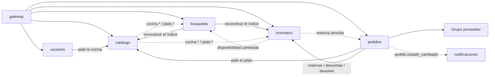

# ADR-001 — Cómo separamos los servicios

- **Estado:** Aceptada (preliminar: se valida en la Entrega 2)
- **Fecha:** 2026-10-09
- **Responsable:** Guillermina Sánchez
- **Decisión del enunciado:** D1 (criterios para separar los servicios, cómo se relacionan y de quién es cada dato)
- **Relacionado con:** [SPEC](../../SPEC.md) · [ARCHITECTURE](../ARCHITECTURE.md) (secciones 3 y 4) · [ADR-003](ADR-003-persistencia.md) · [ADR-005](ADR-005-comunicacion-entre-servicios.md) · [ADR-008](ADR-008-contrato-propio.md)

## Contexto

En GhostKitchen varios restaurantes **comparten los ingredientes de una misma cocina**, y nunca se puede vender más de lo que hay, aunque muchos pidan a la vez ([SPEC](../../SPEC.md), RN01 a RN05). Además el sistema tiene que:

- buscar platos con filtros y sugerir la cocina más cercana;
- reservar ingredientes por 10 minutos y liberarlos si se vence el tiempo;
- manejar pedidos con estados;
- mandar un mail en cada cambio de estado;
- publicar algo para otro grupo y usar lo que publica otro.

El enunciado pide al menos 3 microservicios y un API Gateway.

Para decidir cómo separar tuvimos en cuenta:

1. **Lo que tiene que pasar "de una sola vez" va junto** (Clase 2). Reservar todos los ingredientes de un plato tiene que ser todo o nada.
2. **Datos que se usan distinto van separados** (Clase 2). El catálogo se lee mucho y cambia poco; el stock cambia todo el tiempo y no se puede equivocar.
3. **Si se cae algo secundario, se tiene que poder seguir pidiendo** (Clases 4 y 7). Por ejemplo, el mail o la búsqueda.
4. **La búsqueda no tiene que cargar a la parte que vende** (Clase 5).

## Decisión

Separamos el sistema en **6 microservicios** y un **API Gateway (NGINX)**. Cada servicio tiene su propia base y es el único que la usa (Clase 2).

| Servicio | De qué se encarga | Datos que son suyos | Lo que NO es suyo |
| --- | --- | --- | --- |
| **Usuarios** | Registro, login y roles | Usuarios, contraseñas encriptadas, dirección, rol, cocina elegida por el cliente, cocina de cada cuenta Cocina, localidad de cada admin | Cocinas, pedidos |
| **Catálogo** | Qué se vende y a qué precio | Cocinas (dirección, ubicación, tiempo estimado de entrega, costo de envío), restaurantes (máx. 4 por cocina) y platos (con su foto) | Recetas, stock |
| **Búsqueda** | Encontrar platos y la cocina más cercana | Las **zonas** (barrios con su ubicación, cargadas al iniciar). Todo lo demás son **copias** de datos, armadas para buscar | Platos, cocinas y stock originales |
| **Inventario** | Con qué se hace cada plato y si alcanza | Ingredientes, stock (total y reservado), **recetas**, reservas (con los ingredientes y cantidades que apartó cada una) y movimientos (reposiciones, mermas, descuentos, devoluciones) | Platos (solo guarda su ID y su cocina), pedidos |
| **Pedidos** | La compra | Carritos, confirmaciones en curso, pedidos e historial de estados | Stock, datos de la cuenta del cliente |
| **Notificaciones** | Los mails | Qué mails mandó y cuáles faltan | El estado del pedido |

El **gateway** no guarda datos del negocio. Las API keys de los grupos que nos consumen son configuración suya y no se suben al repositorio.

**Reglas que siguen todos los servicios:**

1. **Nadie entra a la base de otro.** Si un servicio necesita un dato ajeno, lo pide por API o lo recibe por un mensaje.
2. **Las referencias entre servicios usan IDs** (`cocina_id`, `plato_id`, `pedido_id`), sin claves foráneas entre bases. Las respuestas y eventos también incluyen los datos necesarios para cada flujo. El servicio dueño valida los identificadores.
3. **Las recetas están en Inventario.** Catálogo dice *qué se vende y cuánto sale*; Inventario dice *con qué se hace y si alcanza*. Así, reservar es una sola operación en una sola base.
4. **El pedido guarda una copia** del nombre, el precio y el restaurante de cada plato, y del mail del cliente. Si después cambia el precio, el pedido queda con lo que pagó el cliente, y Notificaciones no tiene que preguntarle a Usuarios.
5. **El stock lo decide solo Inventario.** Búsqueda muestra si un plato está disponible, pero es orientativo.
6. **El gateway verifica quién es el usuario; cada servicio decide qué puede hacer.**
7. **Al grupo proveedor lo llama Pedidos**, nunca el frontend ni el gateway.
8. **No hay llamadas en círculo.** Pedidos llama a Catálogo e Inventario, Usuarios llama a Catálogo y Búsqueda llama a Catálogo e Inventario solo para reconstruir su índice, pero ninguno llama de vuelta. Inventario recibe los datos de Catálogo por mensajes.

### Copias de datos de otro servicio

Separar los datos obliga a que algunos servicios guarden **copias** de datos ajenos. Las aceptamos a propósito, y cada una tiene un motivo:

| Copia | Quién la guarda | De quién es el dato | Cómo se actualiza | Si la copia está atrasada… |
| --- | --- | --- | --- | --- |
| Nombre y precio del plato, nombre del restaurante | Pedidos (en cada ítem) | Catálogo | Se copia **una vez**, al agregar al carrito | Es lo que queremos: el pedido conserva el precio que vio el cliente (RN15) |
| Mail del cliente | Pedidos (en cada pedido) | Usuarios | Viene en el token al confirmar | El mail va al correo que tenía al pedir |
| Localidad de la cocina | Pedidos (en cada pedido) | Catálogo | Se copia al crear el pedido, junto con los datos de los platos | Las métricas del admin usan la localidad que tenía la cocina cuando se hizo el pedido |
| Localidad de cada cocina | Inventario | Catálogo | Mensajes `cocina.*` | Inventario **rechaza** los cambios del admin sobre esa cocina hasta tenerla: nunca permite por las dudas |
| De qué cocina es cada plato | Inventario | Catálogo | Mensajes `plato.*` | No se puede cargar la receta de ese plato hasta que llegue |
| Platos, sedes y disponibilidad | Búsqueda (índice de Solr) | Catálogo e Inventario | Mensajes, con hasta 5 s de atraso; se puede reconstruir por API | La disponibilidad es orientativa (RN21): al reservar, Inventario controla el stock real |
| Mail del cliente y estado del pedido | Notificaciones | Pedidos | Mensaje `pedido.estado_cambiado` | No aplica: cada mensaje describe un cambio que ya pasó |

### Por qué el stock y las recetas no están en Catálogo

Es la decisión más discutible, porque parece que el plato y su stock van juntos. Los separamos porque:

- **El stock es de la cocina, no del plato.** Un mismo ingrediente lo usan platos de distintos restaurantes. Para reservar hay que tener la receta y el stock juntos.
- **Se usan de forma muy distinta.** El catálogo se lee mucho y cambia poco (va bien en MongoDB con caché). El stock cambia todo el tiempo y no se puede equivocar (va bien en MySQL con transacciones).
- **Catálogo tiene 2 copias y caché.** El stock no se guarda nunca en caché.

### Por qué el carrito está en Pedidos y la reserva en Inventario

El carrito es **lo que el cliente quiere comprar**: platos, cantidades y precios. La reserva es **lo que se aparta del stock** y hasta cuándo. Por eso Pedidos guarda el carrito e Inventario guarda la reserva. Así, si Pedidos se cae, Inventario igual puede liberar las reservas vencidas.

### Por qué el pedido es uno solo

El que cocina todo es la cocina; los restaurantes son solo marcas. El pedido tiene **un solo estado**, y los platos se agrupan por restaurante solo para mostrarlos.

## Alternativas que pensamos

| Alternativa | A favor | En contra | Qué decidimos |
| --- | --- | --- | --- |
| **Solo 3 servicios** (usuarios, catálogo con stock, pedidos con mails) | Menos trabajo | Mezcla cosas que se usan muy distinto; si falla el mail, afecta a los pedidos | La descartamos |
| **Recetas en Catálogo** | El plato y su receta juntos | Inventario necesitaría una copia de la receta, que podría estar desactualizada justo al reservar | La descartamos |
| **Stock en Catálogo** | Todo en un lugar | Una base pensada para leer, usada para algo que cambia todo el tiempo | La descartamos |
| **Stock en Pedidos** | Reservar y confirmar en una sola operación | Pedidos haría todo; el admin cargaría stock en el servicio de los clientes | La descartamos |
| **Búsqueda dentro de Catálogo** | Un servicio menos | Las búsquedas competirían con la administración del catálogo, y el índice necesita datos de Catálogo **y** de Inventario, así que no es de ninguno de los dos. Separada, crece sola y si se cae no afecta a los pedidos (Clase 5) | La descartamos |
| **Un pedido por restaurante** | Cada marca maneja lo suyo | Los restaurantes no tienen gente propia: cocina todo la cocina | La descartamos |
| **Mails dentro de Pedidos** | Un servicio menos | Si falla el correo, afecta a la confirmación de pedidos | La descartamos, pero es el **plan B** si nos cuesta mucho mantener 6 servicios |
| **Lo que publicamos, en Pedidos** | Pedidos es el centro de la compra | Lo que publicamos es solo de lectura y esos datos ya están en Búsqueda; en Pedidos competiría con las confirmaciones ([ADR-008](ADR-008-contrato-propio.md)) | La descartamos |
| **6 servicios** (la que elegimos) | Cada regla importante está en un solo lugar; si algo falla no tira todo | Más cosas para levantar y mantener | **La elegimos** |

## Consecuencias

**Lo bueno**

- No vender de más se resuelve con **una sola operación en la base de Inventario**.
- Si se caen Búsqueda o Notificaciones, se puede seguir comprando.
- Catálogo y Búsqueda pueden crecer sin tocar la parte que vende.
- Cada servicio usa la base y la organización que mejor le queda ([ADR-003](ADR-003-persistencia.md)).

**Lo que aceptamos**

- **Confirmar un pedido toca dos servicios** (Pedidos e Inventario). Por eso Pedidos coordina los pasos (saga) y usa claves para no repetir nada.
- **Es más trabajo para un equipo de tres.** Lo compensamos con un solo `docker compose`, una sola instancia de MySQL y una de MongoDB en local (con una base por servicio) y monitoreo desde el principio.
- **Algunas copias pueden tener unos segundos de atraso:** la búsqueda (máximo 5 s) y los datos de Catálogo que guarda Inventario.
- **Hay datos repetidos a propósito:** ver la tabla de copias.

**Riesgos**

| Riesgo | Qué hacemos |
| --- | --- |
| Que Pedidos empiece a saber de stock | Pedidos solo dice "reservá / descontá / devolvé"; las reglas están en Inventario |
| Que el gateway termine teniendo lógica del negocio | El gateway solo rutea, verifica el login, limita y reparte la carga |
| Que Inventario use una localidad vieja o que todavía no le llegó | Cada mensaje `cocina.*` trae una versión, e Inventario solo guarda una versión más nueva que la que tiene. Si no tiene la localidad de una cocina, **rechaza** los cambios del admin sobre ella. El *seed* carga las 4 cocinas al iniciar |

## Cómo lo vamos a validar

- **Entrega 2:** revisar que ningún servicio necesite entrar a la base de otro. Si pasa, separamos mal y hacemos un ADR nuevo que reemplace a este (sin borrarlo).
- **Entrega final:** con 200 personas reservando el último plato a la vez, **0 platos vendidos de más**. Y si tiramos Búsqueda o Notificaciones, los pedidos se siguen confirmando.

## Referencias

- Clase 1: monolito y microservicios; un servicio por parte del negocio.
- Clase 2: una base por servicio, transacciones entre servicios, saga y outbox.
- Clase 4: mensajería; desacoplar lo que puede hacerse después.
- Clase 5: el índice de búsqueda como copia derivada de los datos.
- Clase 6: el gateway como única entrada; quién es se verifica en el borde, qué puede hacer lo decide cada servicio.
- Clase 7: fallas parciales y aislamiento.