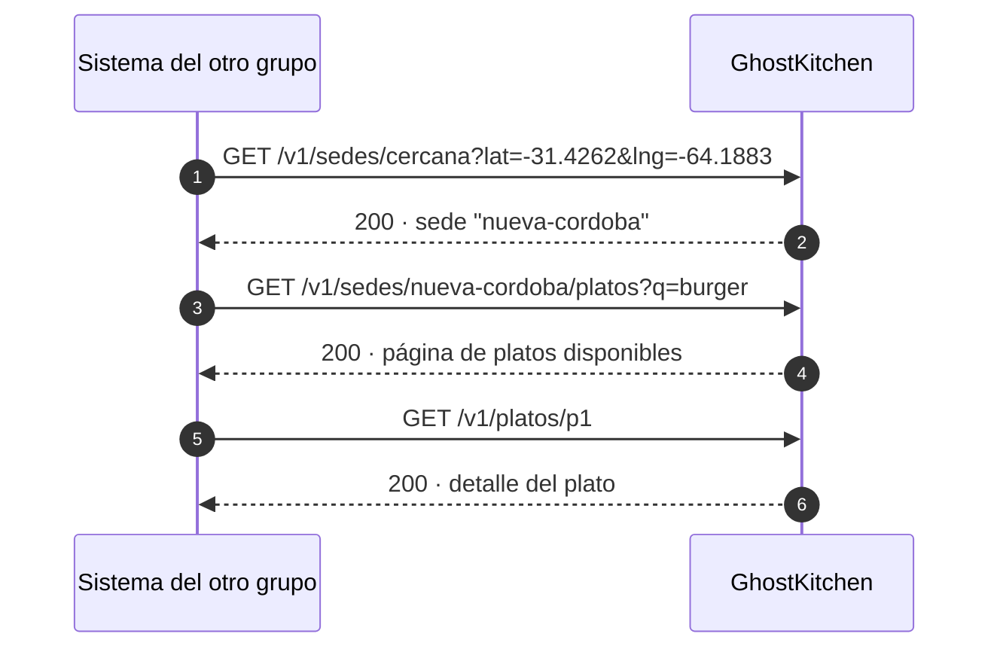

# Capacidad publicada: cocina más cercana y platos disponibles

GhostKitchen tiene **4 cocinas fantasma en Córdoba** (las llamamos sedes). Desde cada una venden hasta 4 restaurantes, y un pedido puede tener platos de todos ellos en un solo envío.

Con esto, otro grupo de Arquitectura de Software 2026 nos manda una ubicación (latitud y longitud) y puede:

1. saber **qué sede le queda más cerca y a cuántos km**;
2. ver **qué platos se pueden pedir ahora** en esa sede, buscando por texto, categoría, etiqueta, restaurante o precio, con orden y páginas.

Es **solo de lectura**: desde afuera no se puede reservar, tocar el stock ni crear pedidos.

| | |
| --- | --- |
| **Versión vigente** | `1.0.0` (ruta `/v1`) |
| **Contrato** | [`v1/openapi.yaml`](v1/openapi.yaml) (OpenAPI 3.0.3) |
| **Mock** | `http://localhost:4010` (ver [Probar sin esperar al backend](#probar-sin-esperar-al-backend-mock)) |
| **URL pública** | Se publica en la Entrega 2 (23/10/2026) y se agrega acá y en `servers` del contrato |
| **Historial** | [CHANGELOG.md](CHANGELOG.md) |
| **Decisión de diseño** | [ADR-008](../adr/ADR-008-contrato-propio.md) |
| **Responsable** | Lucía Rucci (ver [Contacto](#contacto)) |

## Dónde conectarse

| Entorno | URL base | Desde cuándo |
| --- | --- | --- |
| Mock local | `http://localhost:4010` | Ya disponible |
| Nuestro sistema en local, detrás del gateway | `http://localhost:8080/public` | Entrega 2 |
| Nube | *se agrega acá* | Entrega 2 |

Todas las rutas empiezan con la versión: `{URL base}/v1/...`

## Operaciones

| Operación | Método y ruta | Para qué |
| --- | --- | --- |
| `listarSedes` | `GET /v1/sedes` | Las 4 sedes con su ubicación y sus restaurantes |
| `buscarSedeCercana` | `GET /v1/sedes/cercana?lat=&lng=` | La sede activa más cercana a una ubicación y la distancia en km |
| `buscarPlatos` | `GET /v1/sedes/{sedeId}/platos` | Platos de una sede con filtros, orden y paginación |
| `obtenerPlato` | `GET /v1/platos/{platoId}` | Detalle y disponibilidad actual de un plato |

Flujo típico:



### Sedes

| `sedeId` | Cocina | Restaurantes |
| --- | --- | --- |
| `nueva-cordoba` | Cocina Nueva Córdoba | Mostaza, Sushi Club, Kentucky, Grido |
| `cerro` | Cocina Cerro | Johnny B. Good, Il Gatto, Green Eat, Havanna |
| `villa-allende` | Cocina Villa Allende | Big Pons, KFC, El Club de la Milanesa, Dunkin' Donuts |
| `barrio-jardin` | Cocina Barrio Jardín | Dean & Dennys, Sushi Pop, La Cabrera, Café Martínez |

### Parámetros de `buscarPlatos`

| Parámetro | Tipo | Por defecto | Descripción |
| --- | --- | --- | --- |
| `q` | texto (≤ 100) | — | Texto libre; ignora mayúsculas y acentos |
| `categoria` | texto | — | Por ejemplo `Hamburguesas`, `Sushi`, `Pizza`, `Pastas`, `Postres` |
| `etiqueta` | `Vegano` · `Vegetariano` · `Sin TACC` · `Picante` | — | Restricción alimentaria |
| `restauranteId` | texto | — | Limitar a un restaurante de la sede |
| `precioMax` | entero ≥ 1 (ARS) | — | Precio máximo, inclusive |
| `soloDisponibles` | booleano | `true` | `false` incluye los platos sin stock |
| `orden` | `relevancia` · `precio_asc` · `precio_desc` | `relevancia` | Criterio de orden |
| `page` | entero ≥ 1 | `1` | Página |
| `pageSize` | 1 a 50 | `20` | Resultados por página |

## Cómo usarla

- **Clave:** en cada pedido tienen que mandar el header `X-API-Key`. Cada grupo recibe **su propia clave** por un canal privado. No la suban a su repositorio: guárdenla en una variable de entorno. Si se filtra, avísennos y les damos otra.
- **Límite:** 60 pedidos por minuto por clave. Cada respuesta dice cuántos les quedan (`RateLimit-Remaining`). Si se pasan, responde `429` y les dice cuánto esperar (`Retry-After`).
- **Se puede reintentar sin miedo:** todo es `GET`, o sea que solo consulta y no cambia nada.
- **Distancia:** es en línea recta. Si no hay ninguna sede a menos de 25 km, `buscarSedeCercana` responde `404 SIN_COBERTURA`.
- **Disponibilidad:** el campo `disponible` puede tener **hasta 5 segundos de atraso** y **no reserva nada**. Muéstrenlo como algo orientativo ("disponible ahora").
- **Campos nuevos:** **ignoren los campos que no conozcan**. En la `v1` podemos agregar campos, pero nunca vamos a sacar uno ni cambiar lo que significa.
- **Seguimiento:** si nos mandan un `X-Correlation-Id`, se lo devolvemos y queda en nuestros logs. Pásenlo cuando nos avisen de un problema, así lo encontramos rápido.
- **Recomendación:** esperen como máximo 2 s por respuesta. Reintenten solo si responde `503`, si falla la conexión o si responde `429` (en ese caso, después de lo que indique `Retry-After`). Esperen cada vez más entre intentos (1 s, 2 s, 4 s) y como máximo 3 veces. Nunca reintenten un `400`, `401` o `404`: repetir la misma solicitud no cambia el resultado.

## Errores

Todos los errores tienen el mismo formato JSON (el estándar *Problem Details*, RFC 9457). Para saber qué pasó, usen el campo **`code`**, que no cambia; el texto de `detail` puede cambiar.

| HTTP | `code` | Qué significa | ¿Reintentar? |
| --- | --- | --- | --- |
| 400 | `PARAMETRO_INVALIDO` | Un parámetro no cumple el contrato (detalle en `errores`) | No, corregir la solicitud |
| 401 | `API_KEY_INVALIDA` | Falta la clave o no es válida | No |
| 404 | `SIN_COBERTURA` | No hay sedes activas a menos de 25 km de esa ubicación | No |
| 404 | `SEDE_NO_ENCONTRADA` | La sede no existe o no está activa | No |
| 404 | `PLATO_NO_ENCONTRADO` | El plato no existe o fue desactivado | No |
| 429 | `LIMITE_EXCEDIDO` | Se superó el límite por minuto | Sí, después de `Retry-After` |
| 503 | `SERVICIO_NO_DISPONIBLE` | La búsqueda no está disponible en este momento | Sí, esperando cada vez más |

Ejemplo de error:

```json
{
  "type": "https://ghostkitchen.dev/errores/sin-cobertura",
  "title": "Sin cobertura",
  "status": 404,
  "code": "SIN_COBERTURA",
  "detail": "No hay sedes activas a menos de 25 km de esa ubicación.",
  "correlationId": "7d1c2a90-3f4e-4b4a-9a55-1f0a2c8e6b11"
}
```

## Ejemplos

### 1. ¿Qué sede atiende esta ubicación? (Argüello)

```bash
curl -H "X-API-Key: <tu-clave>" "http://localhost:4010/v1/sedes/cercana?lat=-31.333&lng=-64.255"
```

```json
{
  "distanciaKm": 4.5,
  "sede": {
    "id": "cerro",
    "nombre": "Cocina Cerro",
    "localidad": "Cerro de las Rosas",
    "direccion": "Rafael Núñez 4520",
    "ubicacion": { "lat": -31.3682, "lng": -64.2318 },
    "tiempoEntregaMin": 30,
    "tiempoEntregaMax": 40,
    "costoEnvio": 1300,
    "restaurantes": [
      { "id": "r5", "nombre": "Johnny B. Good" },
      { "id": "r6", "nombre": "Il Gatto" },
      { "id": "r7", "nombre": "Green Eat" },
      { "id": "r8", "nombre": "Havanna" }
    ]
  }
}
```

### 2. Hamburguesas de hasta $15.000 en Nueva Córdoba, de menor a mayor precio

```bash
curl -H "X-API-Key: <tu-clave>" \
  "http://localhost:4010/v1/sedes/nueva-cordoba/platos?q=burger&precioMax=15000&orden=precio_asc&page=1&pageSize=20"
```

Cada plato trae su restaurante, su sede, el precio, `disponible` y `actualizadoEn`:

```json
{
  "id": "p1",
  "nombre": "Mega doble",
  "categoria": "Hamburguesas",
  "etiquetas": [],
  "precio": 12900,
  "moneda": "ARS",
  "disponible": true,
  "restaurante": { "id": "r1", "nombre": "Mostaza" },
  "sede": { "id": "nueva-cordoba", "nombre": "Cocina Nueva Córdoba" },
  "actualizadoEn": "2026-10-09T18:42:10Z"
}
```

La respuesta completa trae además `page`, `pageSize`, `total` y `totalPages` para paginar.

> El mock devuelve siempre el ejemplo del contrato: no aplica los filtros ni calcula la distancia. La implementación real sí.

### 3. Platos veganos de una sede (incluyendo los sin stock)

```bash
curl -H "X-API-Key: <tu-clave>" \
  "http://localhost:4010/v1/sedes/nueva-cordoba/platos?etiqueta=Vegano&soloDisponibles=false"
```

### 4. Detalle de un plato

```bash
curl -H "X-API-Key: <tu-clave>" -H "X-Correlation-Id: mi-prueba-001" \
  http://localhost:4010/v1/platos/p5
```

## Probar sin esperar al backend (mock)

El mock lo arma [Prism](https://github.com/stoplightio/prism) leyendo `v1/openapi.yaml`, así que siempre coincide con el contrato. Desde la carpeta del repositorio:

```bash
docker compose up
```

- Queda en `http://localhost:4010`.
- Responde los ejemplos del contrato y **controla** lo que le mandan: si un dato está mal (por ejemplo `lat=200`) devuelve un error, y si falta `X-API-Key` devuelve `401`. En el mock sirve cualquier clave.
- Es una simulación: no verifica una clave contra un registro de consumidores, no aplica el límite de 60 solicitudes y no devuelve necesariamente el `X-Correlation-Id` recibido. Los errores y headers de ejemplo permiten preparar al cliente, pero esos comportamientos se implementan en el gateway real.
- Para probar un error, agreguen el header `Prefer` con el código que quieran:

  ```bash
  curl -H "X-API-Key: x" -H "Prefer: code=404" "http://localhost:4010/v1/sedes/cercana?lat=-33.1&lng=-64.3"
  curl -H "X-API-Key: x" -H "Prefer: code=503" http://localhost:4010/v1/sedes
  ```

  Sirve para probar su manejo de errores y su test de contrato.

Sin clonar nuestro repositorio, solo con el archivo del contrato y Docker:

```bash
docker run --rm -p 4010:4010 -v "$PWD:/tmp" stoplight/prism:5 mock -h 0.0.0.0 /tmp/openapi.yaml
```

Sin Docker, con Node.js:

```bash
npx --yes @stoplight/prism-cli@5.16.0 mock -h 127.0.0.1 -p 4010 docs/contracts/v1/openapi.yaml
```

Para validar formalmente el contrato, desde la raíz del repositorio:

```bash
npx --yes @apidevtools/swagger-cli@4.0.4 validate docs/contracts/v1/openapi.yaml
```

El mock se comprobó con las cuatro respuestas 200, los tres errores 404, 429, 503, una latitud inválida (400) y la falta de API key (401). Son comprobaciones de ejemplos y validación de solicitudes; no sustituyen los futuros tests de negocio, integración con persistencia ni contrato del proveedor externo. En PowerShell usar `curl.exe` para ejecutar los ejemplos de esta guía.

## Consejos para su test de contrato

1. Comparen nuestras respuestas con `v1/openapi.yaml` (por ejemplo con un validador de OpenAPI) y **no** con un JSON fijo. Así, si agregamos un campo nuevo, su test no se rompe.
2. Prueben al menos:
   - la respuesta `200` de cada operación;
   - `404 SIN_COBERTURA`;
   - `404` de sede y de plato;
   - `429`;
   - `503`.
3. Hagan que el test falle si la versión pasa a `2.x`, porque eso significa que algo cambió de forma incompatible.

## Versiones

- La versión grande va en la ruta (`/v1`) y el número completo en `info.version` (`1.0.0`, `1.1.0`…).
- **Cambios que no rompen nada (siguen en `/v1`):** campos nuevos opcionales, filtros nuevos, nuevas formas de ordenar, operaciones nuevas y sedes nuevas.
- **Cambios que rompen:** van en `/v2`. La `/v1` sigue andando hasta el final de la materia, y les avisamos antes.
- Todos los cambios quedan anotados en el [CHANGELOG.md](CHANGELOG.md).

## Contacto

- **Responsable de la capacidad:** Lucía Rucci.
- **Equipo:** Valentina Rey, Lucía Rucci y Guillermina Sánchez.
- Para pedir una clave, avisarnos de un problema (con el `X-Correlation-Id`) o proponer un cambio, abran un *issue* en este repositorio con la etiqueta `contrato`, o escríbannos por el canal de la materia.
