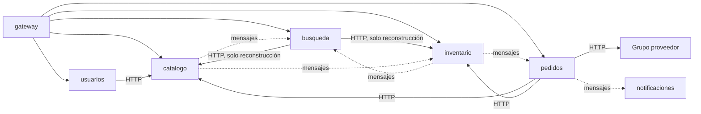

# Microservicios

Cada carpeta es un servicio aparte: va a tener su propio código, su `Dockerfile` y sus tests, y se levanta por separado. En esta entrega cada carpeta tiene solo su `README.md`, donde explicamos qué hace el servicio, qué datos guarda, cómo se organiza por dentro, qué rutas tiene y qué mensajes manda o escucha. El código lo agregamos desde la Entrega 2.

| Servicio | Qué hace | Base | Cómo se organiza por dentro | Puerto |
| --- | --- | --- | --- | --- |
| [usuarios](usuarios/README.md) | Registro, login y roles; recuerda la cocina elegida | MySQL | Capas | 8081 |
| [catalogo](catalogo/README.md) | Cocinas, restaurantes y platos: qué se vende y a qué precio | MongoDB + Memcached | Capas + caché | 8082 (2 copias) |
| [busqueda](busqueda/README.md) | Buscar platos, sugerir la cocina más cercana y atender lo que publicamos | Solr | Capas (entra por HTTP y por mensajes) | 8083 |
| [inventario](inventario/README.md) | Ingredientes, stock, recetas y reservas de 10 minutos | MySQL | Hexagonal liviano | 8084 |
| [pedidos](pedidos/README.md) | Carrito, pedido, estados y la confirmación con Inventario y el proveedor | MySQL | Hexagonal + DDD | 8085 |
| [notificaciones](notificaciones/README.md) | Un mail por cada cambio de estado del pedido | MongoDB | Capas (entra por mensajes) | 8086 |

El gateway (NGINX, puerto 8080) está explicado en [`gateway/`](../gateway/README.md).

## Quién depende de quién

- No hay llamadas en círculo: Pedidos llama a Catálogo e Inventario, Usuarios a Catálogo y Búsqueda a Catálogo e Inventario solo para reconstruir el índice; ninguno llama de vuelta.
- Los mensajes van por RabbitMQ. El detalle está en el [ADR-005](../docs/adr/ADR-005-comunicacion-entre-servicios.md).

## Reglas que siguen todos los servicios

- **Go + Gin**, igual que en el práctico de la materia.
- Todos van a tener tres rutas técnicas:
  - `/health/live`: el servicio está prendido;
  - `/health/ready`: el servicio puede atender (por ejemplo, llega a su base);
  - `/metrics`: números para Prometheus.
- Los logs se escriben en JSON y llevan un identificador para seguir una misma acción entre servicios. **Nunca** se escriben contraseñas ni tokens.
- Las claves se leen de variables de entorno (ver `.env.example`), nunca van en el código.

## Código compartido (`pkg/`, desde la Entrega 2)

Vamos a tener una carpeta `pkg/` con código técnico que usan todos los servicios, **sin reglas del negocio**: los logs, el seguimiento entre servicios, un cliente HTTP con tiempos máximos y reintentos, el formato de los mensajes y la lectura del usuario que manda el gateway.
